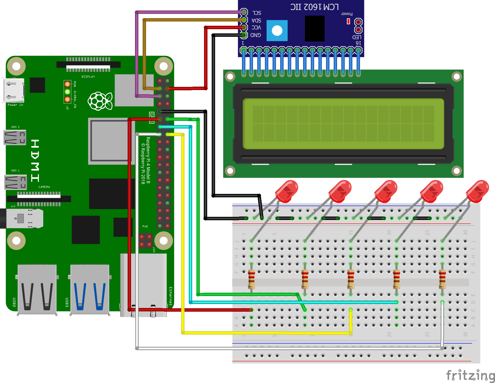

# Raspberry-PI-MobileNetSSDv2-tflite-LED
## _The Last Markdown Editor, Ever_

[](https://nodesource.com/products/nsolid)

[](https://travis-ci.org/joemccann/dillinger)

This GitHub repository show real-time object detection using a Raspberry Pi, MobileNetSSDv2 TensorFlow Lite model, LED indicators, and an LCD display.


## Demo
Below is the following demo video showcasing the Raspberry Pi in action. When real-time object detection processed, video frames show the fps, LED indicators will trun on based on detected classes, and CPU usage and temperature information displayed on the LCD screen.


## Prerequisites
- Raspberry Pi 4 (I'm using 8 GB version)
- Raspberry Pi OS 11 Bulleyes 64-bit
- Pi Camera v2/v1/Web-Camera
- PCB or PCB Dot
- LCD 16x2 Biru/Blue 1602 SPI I2C
- Wiring cable ✨Magic ✨

## Wiring Diagram



Follow this organized table to establish the proper connections, you can also read the reference here [GPIO on Raspberry Pi4](https://pinout.xyz/).

<details>
<summary>LED Wiring - Raspberry Pi</summary>

| Wire Color | GPIO Pin |
|------------|----------|
| Red        | GPIO 17  |
| Green      | GPIO 18  |
| Yellow     | GPIO 23  |
| Cyan       | GPIO 27  |
| White      | GPIO 22  |
| Black (GND)| GND      |

</details>

<details>
<summary>I2C Wiring - Raspberry Pi</summary>

| Wire Color | Connection |
|------------|------------|
| Red        | 5V         |
| Black      | GND        |
| Purple     | SDA        |
| Brown      | SCL        |

</details>


## Installation

To run this project, you need [Python 3.5](https://docs.python.org/3/) or higher installed on your system. Follow these steps to get started:

- Clone the repository and navigate to the project directory: :
```bash
  git clone https://github.com/kiena-dev/Raspberry-PI-MobileNetSSDv2-tflite-LED.git
  cd Raspberry-PI-MobileNetSSDv2-tflite-LED
```

- Create a Python virtual environment (optional but recommended):
```bash
  python3 -m venv venv
```

- Activate the virtual environment:
```bash
  source venv/bin/activate
```

- Install the required dependencies using pip3:
```bash
  pip3 install -r get_requirement.txt
```

Now you have successfully installed the project and its dependencies.
    
## Usage/Examples

```javascript
import Component from 'my-project'

function App() {
  return <Component />
}
```

## Color Reference

| Color             | Hex                                                                |
| ----------------- | ------------------------------------------------------------------ |
| Example Color |  #0a192f |
| Example Color |  #f8f8f8 |
| Example Color |  #00b48a |
| Example Color |  #00d1a0 |


## Authors

- [@kiena](https://github.com/kiena-dev)


## Screenshots


